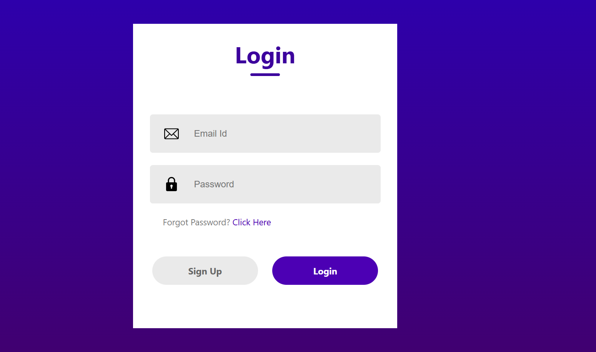

# SignUp-Login Form

## Overview

The **SignUp/Login Form** project is a responsive web application built using React. It features user authentication with a modern interface, ensuring a seamless and secure experience for users.

## Features
- **User Authentication**: Allows users to sign up and log in securely.
- **Real-Time Validation**: Validates user inputs like email, password, and other form fields dynamically.
- **Responsive Design**: Optimized for desktop and mobile devices.
- **Clean Interface**: Intuitive design for easy navigation and usability.

## Technologies Used

- **Frontend**: React
- **Styling**: CSS

## Installation

1. **Clone the Repository**
   ```bash
   git clone https://github.com/ankita34359/SignUp-Login-Form.git
   cd SignUp-Login-Form
   ```

2. **Install Dependencies**
   ```bash
   npm install
   ```

3. **Run the Application**
   ```bash
   npm start
   ```
   Open your browser and navigate to `http://localhost:3000` to access the application.

## Folder Structure

- **`src/`**: Contains all source files, including components and styles.
- **`public/`**: Static files and public assets.
- **`package.json`**: Project dependencies and scripts.

## How to Use

1. Clone the repository and set it up as described in the installation steps.
2. Start the application locally.
3. Use the SignUp form to create an account.
4. Log in using the Login form with your registered credentials.

## Screenshots



## Contributing
Contributions are welcome! Fork the repository, create a new branch, and submit a pull request to add features or fix issues.

## License
This project is licensed under the [MIT License](LICENSE).

---

Enhancing user experiences with secure and intuitive authentication forms! 🚀

